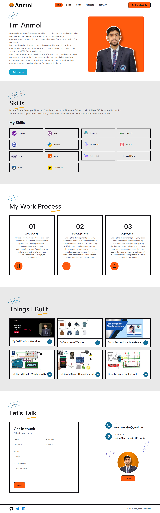

# My Portfolio Website

Welcome to my personal portfolio! This website showcases my skills, projects, and achievements as a Software Engineer. Feel free to browse through my work and contact me if you would like to collaborate or learn more.

## Live Demo

You can view the live version of my portfolio here:  
**[Portfolio URL](https://eranmolgurjar.github.io/)**

## About This Project

This portfolio website was built with the following technologies:

- **HTML** for structure
- **CSS** for styling
- **JavaScript** for interactivity

### Features
- Responsive design: Works seamlessly on mobile, tablet, and desktop devices.
- Interactive project showcase with detailed descriptions and links.
- A contact form for potential collaborators or employers to reach out.
- Section for showcasing technical skills, certifications, and achievements.

Here are some screenshots of the portfolio website:

